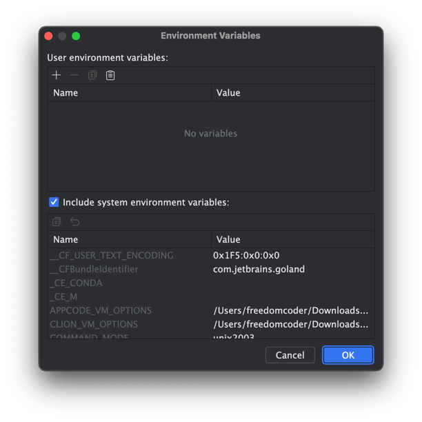

Для запуска:
1. `go install github.com/deepmap/oapi-codegen/v2/cmd/oapi-codegen@latest`
2. `oapi-codegen -generate gorilla,types authentication/api/frontend/frontendapi.yaml > authentication/api/frontend/frontendapi.gen.go`
3. `oapi-codegen -generate gorilla,types documentation/api/frontend/frontendapi.yaml > documentation/api/frontend/frontendapi.gen.go`
4. `go mod tidy -v`
5. `go run main.go`

Configure GoLand run config with the following env vars: 
- DB_USER
- DB_PASSWORD
- DB_NAME
- DB_HOST
- BACKEND_PORT
- DB_DOCUMENTATION_NAME



Для работы с бд
1. установить postgres
2. создать две таблицы, либо выполнить миграции

```
CREATE TABLE auth_user
(
    id serial primary key,
    login character varying(256) NOT NULL,
    salt character varying(256) NOT NULL,
    password character varying(256) NOT NULL
);

CREATE TABLE tokens
(
    id serial primary key,
    user_id integer NOT NULL,
    token character varying(256) NOT NULL
);
```

3. В отдельной бд для документов
```
CREATE TABLE sections
(
    id serial primary key,
    title character varying(256) NOT NULL,
    thumbnail_url character varying(256) NOT NULL,
    is_favorite boolean NOT NULL,
    company_id integer NOT NULL
);

create table user_sections_prefs(
	user_id integer NOT NULL,
	section_id integer NOT NULL,
	FOREIGN KEY (section_id) REFERENCES sections(id),
	PRIMARY KEY (user_id, section_id)
)
```

## Миграции

[Инструкция по установке утилиты для миграций](https://github.com/golang-migrate/migrate/blob/master/cmd/migrate/README.md)

Создание миграции: `migrate create -ext sql -dir {path-to-migrations-dir} {migartion-name}`

Миграция базы вручную (up-миграции также выполняются при запуске приложения):
up: `migrate -path {path-to-migrations-dir} -database "postgres://{DB_USER}:{DB_PASSWORD}@{DB_HOST}:5432/{DB_NAME}" up`
down: `migrate -path {path-to-migrations-dir} -database "postgres://{DB_USER}:{DB_PASSWORD}@{DB_HOST}:5432/{DB_NAME}" down`
